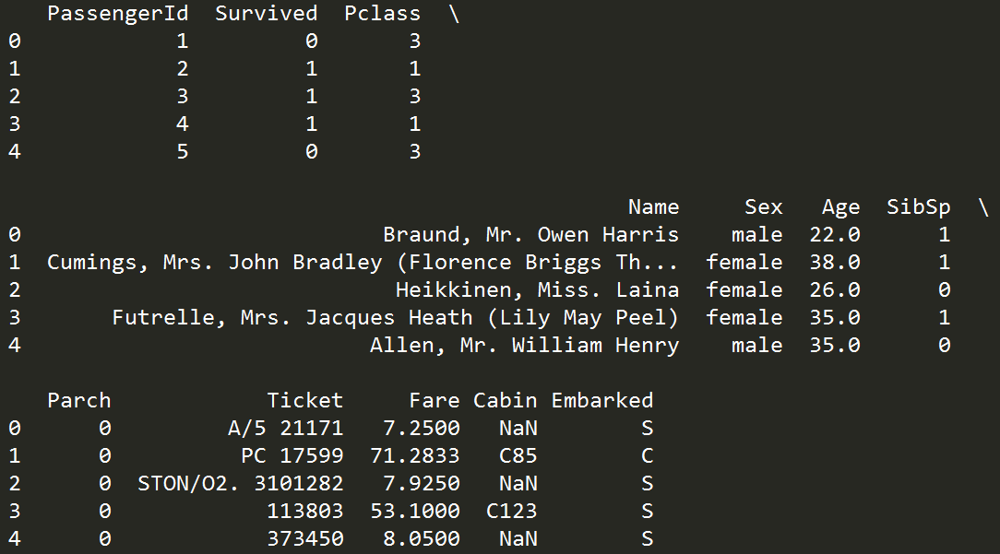
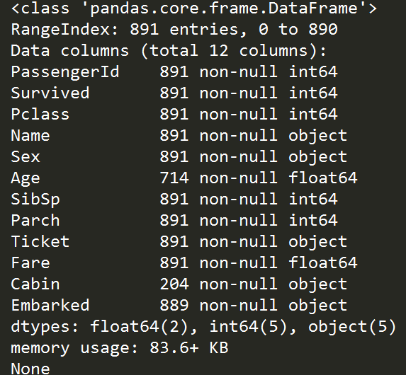
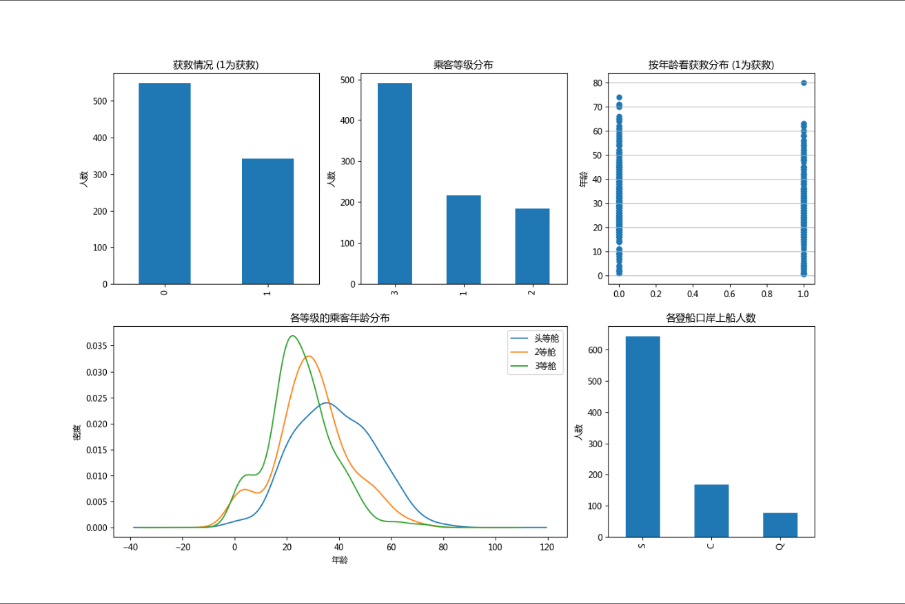
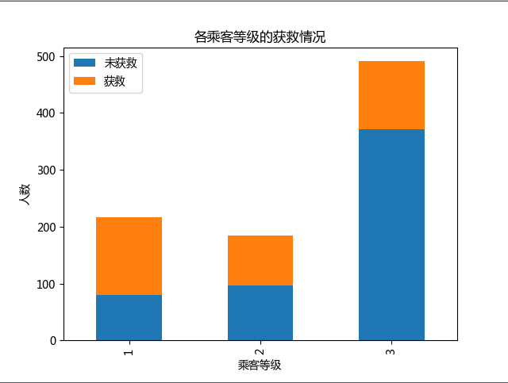
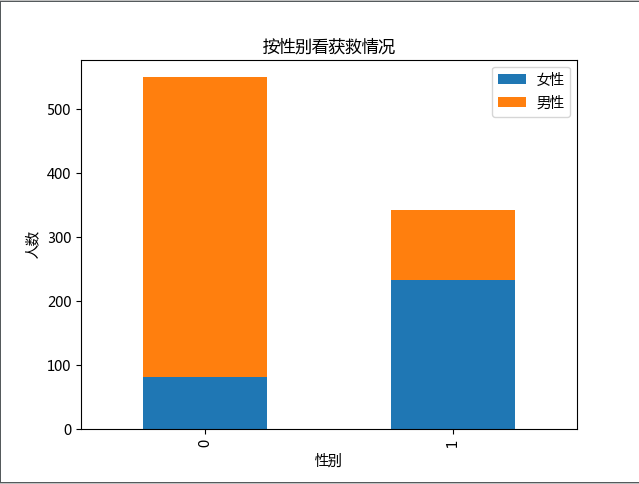
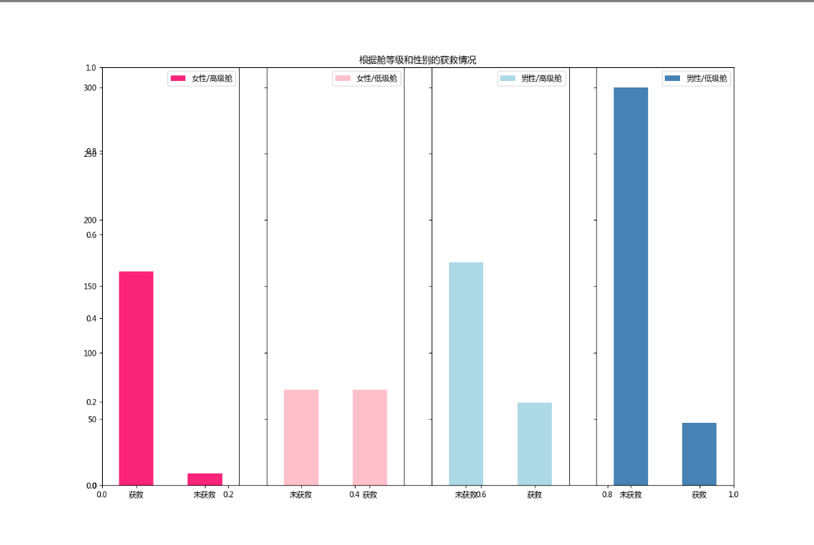
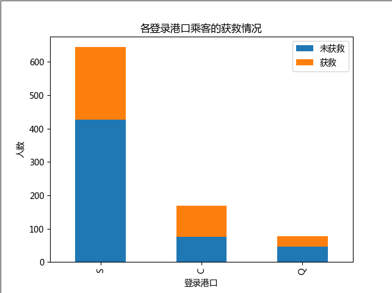
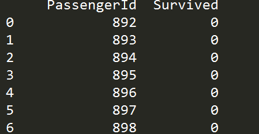

## 一、前言
---
RMS泰坦尼克号的沉没是历史上最臭名昭着的沉船之一。1912年4月15日，在首次航行期间，泰坦尼克号撞上冰山后沉没，2224名乘客和机组人员中有1502人遇难。这场轰动的悲剧震撼了国际社会，并导致了更好的船舶安全条例。

海难导致生命损失的原因之一是没有足够的救生艇给乘客和机组人员。虽然幸存下来的运气有一些因素，但一些人比其他人更有可能生存，比如妇女，儿童和上层阶级。

这篇博客运用了机器学习的相关知识，对泰坦尼克号人员的生存进行预测，主要用到的是sklearn,pandas,numpy,matplotlib等模块。

本文出现的所有代码，均可在我的github上下载，欢迎Follow、Star：[github地址](https://github.com/yaoguangju/machine_learning_practice)

## 二、数据分析
---
这次我们用到的数据集包含train.txt和test.txt两部分，[数据集下载](https://github.com/yaoguangju/machine_learning_practice/tree/master/%E6%B3%B0%E5%9D%A6%E5%B0%BC%E5%85%8B%E5%8F%B7%E6%88%90%E5%91%98%E8%8E%B7%E6%95%91%E6%83%85%E5%86%B5%E9%A2%84%E6%B5%8B/1.%E5%AE%9E%E6%88%98%E4%BB%A3%E7%A0%81)

#### 1、导入数据
编写代码如下
```python
import pandas as pd

titanic = pd.read_csv("train.csv")

print(titanic.head(5))
print(titanic.info())
```
运行结果





这里首先我们看看这些标签代表着什么

- PassengerId => 乘客ID
- Pclass => 乘客等级(1/2/3等舱位)
- Name => 乘客姓名
- Sex => 性别
- Age => 年龄
- SibSp => 堂兄弟/妹个数
- Parch => 父母与小孩个数
- Ticket => 船票信息
- Fare => 票价
- Cabin => 客舱
- Embarked => 登船港口

并且在上面的图示中我们可以看出Age和Cabin这2个标签是不全的，这点我们会在数据处理的时候进行相应的处理。

#### 2.乘客各属性分布

接下来我们画图具体分析一下乘客的属性和具体的获救情况。
编写代码如下

```python
import pandas as pd
import matplotlib.pyplot as plt


titanic = pd.read_csv("train.csv")


fig = plt.figure(figsize=(15,10))
fig.set(alpha=0.2)  # 设定图表颜色alpha参数

plt.subplot2grid((2,3),(0,0))
titanic.Survived.value_counts().plot(kind='bar')
plt.title("获救情况 (1为获救)")
plt.ylabel("人数")

plt.subplot2grid((2,3),(0,1))
titanic.Pclass.value_counts().plot(kind="bar")
plt.ylabel("人数")
plt.title("乘客等级分布")

plt.subplot2grid((2,3),(0,2))
plt.scatter(titanic.Survived, titanic.Age)
plt.ylabel("年龄")
plt.grid(b=True, which='major', axis='y')
plt.title("按年龄看获救分布 (1为获救)")


plt.subplot2grid((2,3),(1,0), colspan=2)
titanic.Age[titanic.Pclass == 1].plot(kind='kde')
titanic.Age[titanic.Pclass == 2].plot(kind='kde')
titanic.Age[titanic.Pclass == 3].plot(kind='kde')
plt.xlabel("年龄")
plt.ylabel("密度")
plt.title("各等级的乘客年龄分布")
plt.legend(('头等舱', '2等舱','3等舱'),loc='best')


plt.subplot2grid((2,3),(1,2))
titanic.Embarked.value_counts().plot(kind='bar')
plt.title("各登船口岸上船人数")
plt.ylabel("人数")
plt.show()
```
运行结果如下图


我们在图上可以看出来：
- 被救的人300多点，不到半数；
- 3等舱乘客非常多；
- 遇难和获救的人年龄似乎跨度都很广；
- 3个不同的舱年龄总体趋势似乎也一致，2和3等舱乘客20岁多点的人最多，1等舱40岁左右的最多
- 登船港口人数按照S、C、Q递减，而且S远多于另外俩港口。

这个时候我们可能会有一些想法了：

- 不同舱位/乘客等级可能和财富/地位有关系，最后获救概率可能会不一样
- 年龄和性别获救概率也一定是有影响的，事故中副船长还说『小孩和女士先走』
- 和登船港口是不是有关系呢？也许登船港口不同，人的出身地位不同

#### 3、乘客舱的等级与获救结果的统计
编写代码如下：
```python
import pandas as pd
import matplotlib.pyplot as plt

titanic = pd.read_csv("train.csv")


#乘客舱的等级的获救情况
fig = plt.figure()
fig.set(alpha=0.2)  # 设定图表颜色alpha参数

Survived_0 = titanic.Pclass[titanic.Survived == 0].value_counts()
Survived_1 = titanic.Pclass[titanic.Survived == 1].value_counts()
df=pd.DataFrame({'获救':Survived_1, '未获救':Survived_0})
df.plot(kind='bar', stacked=True)
plt.title("各乘客等级的获救情况")
plt.xlabel("乘客等级")
plt.ylabel("人数")

plt.show()
```
运行结果如下图所示



这里可以看出乘客舱为1的乘客相比于乘客舱为2和3的乘客，获救的概率高很多。这是影响最后获救结果的一个重要特征。

#### 4、乘客性别与获救结果的统计
编写代码如下:
```python
import pandas as pd
import matplotlib.pyplot as plt

titanic = pd.read_csv("train.csv")

#看看各性别的获救情况
fig = plt.figure()
fig.set(alpha=0.2)  # 设定图表颜色alpha参数

Survived_m = titanic.Survived[titanic.Sex == 'male'].value_counts()
Survived_f = titanic.Survived[titanic.Sex == 'female'].value_counts()
df=pd.DataFrame({u'男性':Survived_m, u'女性':Survived_f})
df.plot(kind='bar', stacked=True)
plt.title(u"按性别看获救情况")
plt.xlabel(u"性别")
plt.ylabel(u"人数")
plt.show()
```
运行结果如下



可以看的出，明显女性获救的几率要大。

如果我们结合着乘客舱等级来看呢

编写代码如下
```python
import pandas as pd
import matplotlib.pyplot as plt

titanic = pd.read_csv("train.csv")

fig=plt.figure(figsize=(15,10))
fig.set(alpha=0.65) # 设置图像透明度，无所谓
plt.title(u"根据舱等级和性别的获救情况")

ax1=fig.add_subplot(141)
titanic.Survived[titanic.Sex == 'female'][titanic.Pclass != 3].value_counts().plot(kind='bar', label="female highclass", color='#FA2479')
ax1.set_xticklabels([u"获救", u"未获救"], rotation=0)
ax1.legend([u"女性/高级舱"], loc='best')

ax2=fig.add_subplot(142, sharey=ax1)
titanic.Survived[titanic.Sex == 'female'][titanic.Pclass == 3].value_counts().plot(kind='bar', label='female, low class', color='pink')
ax2.set_xticklabels([u"未获救", u"获救"], rotation=0)
plt.legend([u"女性/低级舱"], loc='best')

ax3=fig.add_subplot(143, sharey=ax1)
titanic.Survived[titanic.Sex == 'male'][titanic.Pclass != 3].value_counts().plot(kind='bar', label='male, high class',color='lightblue')
ax3.set_xticklabels([u"未获救", u"获救"], rotation=0)
plt.legend([u"男性/高级舱"], loc='best')

ax4=fig.add_subplot(144, sharey=ax1)
titanic.Survived[titanic.Sex == 'male'][titanic.Pclass == 3].value_counts().plot(kind='bar', label='male low class', color='steelblue')
ax4.set_xticklabels([u"未获救", u"获救"], rotation=0)
plt.legend([u"男性/低级舱"], loc='best')

plt.show()
```
运行结果如下



这里就可以明显的看出，高级舱中的女性生还的几率比较高，但是低级舱的男性获救几率则比较低了。

#### 5、看看各登录港口的获救情况
编写代码如下
```python
import pandas as pd
import matplotlib.pyplot as plt

titanic = pd.read_csv("train.csv")


#看看各登录港口的获救情况
fig = plt.figure()
fig.set(alpha=0.2)  # 设定图表颜色alpha参数

Survived_0 = titanic.Embarked[titanic.Survived == 0].value_counts()
Survived_1 = titanic.Embarked[titanic.Survived == 1].value_counts()
df=pd.DataFrame({'获救':Survived_1, '未获救':Survived_0})
df.plot(kind='bar', stacked=True)
plt.title("各登录港口乘客的获救情况")
plt.xlabel("登录港口")
plt.ylabel("人数")

plt.show()

```
运行结果如下



这个看起来并没有什么差别

## 三、数据处理
---
在上一节中我们知道，年龄(Age)有许多缺失值，这里我们用scikit-learn中的RandomForest来拟合一下缺失的年龄数据,而客舱(Cabin)这项数据值缺失太多，我们直接舍弃就好了。

编写代码如下
```python
import pandas as pd
from sklearn.ensemble import RandomForestRegressor

titanic = pd.read_csv("train.csv")

### 使用 RandomForestClassifier 填补缺失的年龄属性
def set_missing_ages(df):
    # 把已有的数值型特征取出来丢进Random Forest Regressor中
    age_df = df[['Age', 'Fare', 'Parch', 'SibSp', 'Pclass']]

    # 乘客分成已知年龄和未知年龄两部分
    known_age = age_df[age_df.Age.notnull()].as_matrix()
    unknown_age = age_df[age_df.Age.isnull()].as_matrix()
    
    # y即目标年龄
    y = known_age[:, 0]

    # X即特征属性值
    X = known_age[:, 1:]

    # fit到RandomForestRegressor之中
    rfr = RandomForestRegressor(random_state=0, n_estimators=2000, n_jobs=-1)
    rfr.fit(X, y)

    # 用得到的模型进行未知年龄结果预测
    predictedAges = rfr.predict(unknown_age[:, 1::])

    # 用得到的预测结果填补原缺失数据
    df.loc[(df.Age.isnull()), 'Age'] = predictedAges

    return df

titanic = set_missing_ages(titanic)

#将Embarked,Sex,Pclass转换成为onehot编码
dummies_Embarked = pd.get_dummies(titanic['Embarked'], prefix= 'Embarked')
dummies_Sex = pd.get_dummies(titanic['Sex'], prefix= 'Sex')
dummies_Pclass = pd.get_dummies(titanic['Pclass'], prefix= 'Pclass')

df = pd.concat([titanic, dummies_Embarked, dummies_Sex, dummies_Pclass], axis=1)
df.drop(['Pclass', 'Name', 'Sex', 'Ticket', 'Cabin', 'Embarked'], axis=1, inplace=True)

print(df)
```
运行结果如下图所示


## 四、用sklearn对泰坦尼克号的获救情况进行预测
---
下面我们编写代码对获救情况进行分析
```python
import pandas as pd
from sklearn import model_selection
from sklearn.ensemble import RandomForestRegressor
from sklearn.ensemble import RandomForestClassifier


titanic = pd.read_csv("train.csv")

### 使用 RandomForestClassifier 填补缺失的年龄属性
def set_missing_ages(df):
    # 把已有的数值型特征取出来丢进Random Forest Regressor中
    age_df = df[['Age', 'Fare', 'Parch', 'SibSp', 'Pclass']]

    # 乘客分成已知年龄和未知年龄两部分
    known_age = age_df[age_df.Age.notnull()].as_matrix()
    unknown_age = age_df[age_df.Age.isnull()].as_matrix()

    # y即目标年龄
    y = known_age[:, 0]

    # X即特征属性值
    X = known_age[:, 1:]

    # fit到RandomForestRegressor之中
    rfr = RandomForestRegressor(random_state=0, n_estimators=2000, n_jobs=-1)
    rfr.fit(X, y)

    # 用得到的模型进行未知年龄结果预测
    predictedAges = rfr.predict(unknown_age[:, 1::])

    # 用得到的预测结果填补原缺失数据
    df.loc[(df.Age.isnull()), 'Age'] = predictedAges

    return df

titanic = set_missing_ages(titanic)

dummies_Embarked = pd.get_dummies(titanic['Embarked'], prefix= 'Embarked')
dummies_Sex = pd.get_dummies(titanic['Sex'], prefix= 'Sex')
dummies_Pclass = pd.get_dummies(titanic['Pclass'], prefix= 'Pclass')

df = pd.concat([titanic, dummies_Embarked, dummies_Sex, dummies_Pclass], axis=1)
df.drop(['Pclass', 'Name', 'Sex', 'Ticket', 'Cabin', 'Embarked'], axis=1, inplace=True)


# 将数据的Label分离出来
train_label = df['Survived']
train_titanic = df.drop('Survived', 1)

# 对数据进行模型预测
alg = RandomForestClassifier(random_state=1, n_estimators=10, min_samples_split=2, min_samples_leaf=1)
kf = model_selection.KFold(n_splits=3,shuffle=False, random_state=None)
scores = model_selection.cross_val_score(alg, train_titanic, train_label, cv=kf)

print(scores.mean())
```
运行结果如下：


可以看到我们的正确率大约是80%。

接下来，我们把这些数据到测试集上进行预测。

编写代码如下
```python
import pandas as pd
import numpy as np
from sklearn import model_selection
from sklearn.ensemble import RandomForestRegressor
from sklearn.ensemble import RandomForestClassifier


titanic = pd.read_csv("train.csv")


### 使用 RandomForestClassifier 填补缺失的年龄属性
def set_missing_ages(df):
    # 把已有的数值型特征取出来丢进Random Forest Regressor中
    age_df = df[['Age', 'Fare', 'Parch', 'SibSp', 'Pclass']]

    # 乘客分成已知年龄和未知年龄两部分
    known_age = age_df[age_df.Age.notnull()].as_matrix()
    unknown_age = age_df[age_df.Age.isnull()].as_matrix()

    # y即目标年龄
    y = known_age[:, 0]

    # X即特征属性值
    X = known_age[:, 1:]

    # fit到RandomForestRegressor之中
    rfr = RandomForestRegressor(random_state=0, n_estimators=2000, n_jobs=-1)
    rfr.fit(X, y)

    # 用得到的模型进行未知年龄结果预测
    predictedAges = rfr.predict(unknown_age[:, 1::])

    # 用得到的预测结果填补原缺失数据
    df.loc[(df.Age.isnull()), 'Age'] = predictedAges

    return df

titanic = set_missing_ages(titanic)

dummies_Embarked = pd.get_dummies(titanic['Embarked'], prefix= 'Embarked')
dummies_Sex = pd.get_dummies(titanic['Sex'], prefix= 'Sex')
dummies_Pclass = pd.get_dummies(titanic['Pclass'], prefix= 'Pclass')

df = pd.concat([titanic, dummies_Embarked, dummies_Sex, dummies_Pclass], axis=1)
df.drop(['Pclass', 'Name', 'Sex', 'Ticket', 'Cabin', 'Embarked'], axis=1, inplace=True)

# print(df)

# 将数据的Label分离出来
train_label = df['Survived']
train_titanic = df.drop('Survived', 1)

# 对数据进行模型预测
alg = RandomForestClassifier(random_state=1, n_estimators=10, min_samples_split=2, min_samples_leaf=1)
kf = model_selection.KFold(n_splits=3,shuffle=False, random_state=None)
scores = model_selection.cross_val_score(alg, train_titanic, train_label, cv=kf)

# # print(scores.mean())


# 导入测试集的数据，并将数据和测试集上的数据进行一样的处理
titanic_test = pd.read_csv("test.csv")
titanic_test = set_missing_ages(titanic_test)
dummies_Embarked = pd.get_dummies(titanic_test['Embarked'], prefix= 'Embarked')
dummies_Sex = pd.get_dummies(titanic_test['Sex'], prefix= 'Sex')
dummies_Pclass = pd.get_dummies(titanic_test['Pclass'], prefix= 'Pclass')
df_test = pd.concat([titanic_test,dummies_Embarked, dummies_Sex, dummies_Pclass], axis=1)
df_test.drop(['Pclass', 'Name', 'Sex', 'Ticket', 'Cabin', 'Embarked'], axis=1, inplace=True)


# 先用训练集上的数据训练处一个模型，再在测试集上进行预测，并将结果输出到一个csv文件中
model = RandomForestClassifier(random_state=1, n_estimators=10, min_samples_split=2, min_samples_leaf=1)
model.fit(train_titanic, train_label)
predictions = model.predict(df_test)
result = pd.DataFrame({'PassengerId':titanic_test['PassengerId'].as_matrix(), 'Survived':predictions.astype(np.int32)})
result.to_csv("random_forest_predictions.csv", index=False)
print(pd.read_csv("random_forest_predictions.csv"))
```

运行结果如下



这样我们的结果便已经预测出来了，并且数据保存在同目录下的random_forest_predictions.csv文件中

五、总结
---
本篇文章主要用了机器学习的sklearn库，配合着numpy，pandas，matplotlib的技术路线，利用随机森林算法对泰坦尼克号成员获救情况进行了预测。

